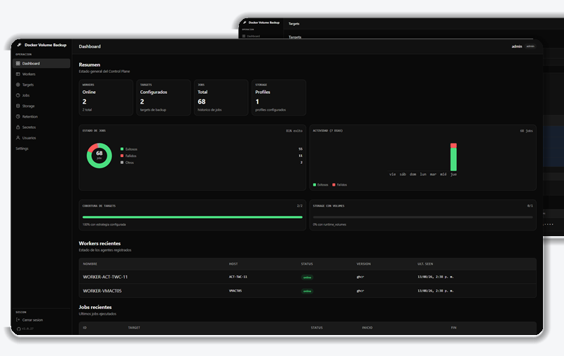
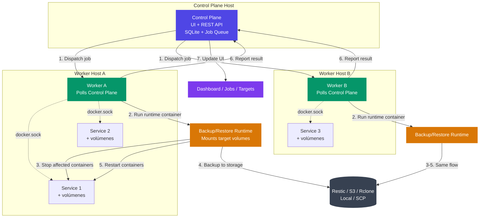

# docker-volume-backup

Sistema de backup y restore centralizado para volúmenes Docker, con arquitectura
**Control Plane + Workers**, UI web, soporte para Restic/Rclone, y backups
fríos (deteniendo contenedores) o calientes.



## Características principales

- **Arquitectura Control Plane + Workers**: UI centralizada para operar backups
  y restores de múltiples hosts desde un solo lugar
- **Workers auto-descubren** los compose projects y volúmenes vía `docker.sock`
- **Backup frío (cold)**: detiene los contenedores del target durante el backup
  y los reinicia después, para garantizar consistencia
- **Restore frío (cold)**: detiene solo los contenedores que montan los volúmenes
  del target, restaura, y los reinicia
- **Restic**: backups eficientes, deduplicados e incrementales
- **Rclone**: upload a cualquier cloud provider (Google Drive, OneDrive, S3, Dropbox, etc.)
- **Tar**: backups tradicionales en tarball, con opción de cifrado GPG
- **Múltiples backends de almacenamiento**: local, S3, SCP, Rclone
- **Secretos cifrados** gestionados desde la UI
- **Retention policies** configurables por target
- **Snapshots** con exploración y restore selectivo
- **Multi-arch**: imágenes para `linux/amd64` y `linux/arm64`

## Arquitectura



### Flujo de un job

1. El operador dispara un backup/restore desde la UI del Control Plane
2. El Control Plane encola el job y lo asigna al Worker correspondiente
3. El Worker levanta un **runtime container** efímero que monta los volúmenes del target
4. Si es cold backup/restore, el runtime detiene los contenedores afectados
5. El runtime ejecuta el backup (Restic/tar) o el restore, sube a storage
6. El runtime reinicia los contenedores detenidos
7. El Worker reporta el resultado (logs, snapshots, métricas) al Control Plane
8. La UI se actualiza en tiempo real con polling

## Inicio rápido

### 1. Levantar el Control Plane

```powershell
$env:CONTROL_PLANE_PUBLISHED_PORT="18080"
docker compose -f deploy/control-plane/docker-compose.yml up -d --build
```

La UI queda en `http://127.0.0.1:18080/`.

<details>
<summary>Linux / macOS</summary>

```bash
CONTROL_PLANE_PUBLISHED_PORT=18080 \
docker compose -f deploy/control-plane/docker-compose.yml up -d --build
```
</details>

### 2. Levantar el Worker

```powershell
docker compose -f deploy/worker/docker-compose.yml up -d --build
```

El worker incluye un servicio `demo-app` (nginx) de ejemplo. Edita
`deploy/worker/docker-compose.yml` para añadir tus propios servicios con
sus volúmenes — el worker los descubrirá automáticamente vía `docker.sock`.

### 3. Configurar el backup desde la UI

Abre `http://127.0.0.1:18080/`, inicia sesión y:

1. Crea un **secreto** (ej: `rclone.conf` o contraseña de Restic)
2. Crea un **storage profile** que referencie ese secreto
3. Crea un **target** seleccionando el worker y el compose project
4. Dispara un **backup** desde el botón de la UI

### Primer login

- Usuario: `admin`
- Contraseña inicial: `changeme`
- El sistema fuerza cambio de contraseña en el primer acceso

## Imágenes publicadas en GHCR

Si no quieres construir localmente, usa los composes `*.ghcr.yml`:

```powershell
$env:CONTROL_PLANE_PUBLISHED_PORT="18080"
docker compose -f deploy/control-plane/docker-compose.ghcr.yml up -d
docker compose -f deploy/worker/docker-compose.ghcr.yml up -d
```

Imágenes:

| Imagen | Uso |
|---|---|
| `ghcr.io/danielrondongarcia/docker-volume-backup-control-plane` | Control Plane (UI + API) |
| `ghcr.io/danielrondongarcia/docker-volume-backup-worker` | Worker (agente en el host de los servicios) |
| `ghcr.io/danielrondongarcia/docker-volume-backup` | Runtime de backup/restore legacy (usado internamente por el worker) |

Cada imagen recibe los tags: `latest`, `{version}`, `{major}.{minor}`, `{major}`.

## Backup frío (detener contenedores)

Para garantizar backups consistentes de bases de datos u otros servicios
que escriben activamente, puedes detener los contenedores durante el backup.

Añade el label al contenedor que quieres detener:

```yaml
services:
  database:
    image: postgres:16
    volumes:
      - db-data:/var/lib/postgresql/data
    labels:
      - "docker-volume-backup.stop-during-backup=true"

  backup:
    image: ghcr.io/danielrondongarcia/docker-volume-backup
    volumes:
      - /var/run/docker.sock:/var/run/docker.sock:ro
      - db-data:/backup/db-data:ro

volumes:
  db-data:
```

El runtime buscará los contenedores con ese label, los detendrá, hará el
backup, y los reiniciará.

## Backup con Restic y Rclone

```yaml
services:
  app:
    image: my-app
    volumes:
      - app-data:/data

  backup:
    image: ghcr.io/danielrondongarcia/docker-volume-backup
    environment:
      BACKUP_STRATEGY: restic
      RESTIC_REPOSITORY: rclone:myremote:/backups/docker-volumes
      RESTIC_PASSWORD: my-secure-password
      BACKUP_CRON_EXPRESSION: "0 2 * * *"
    volumes:
      - app-data:/backup/app-data:ro
      - ./rclone.conf:/root/.config/rclone/rclone.conf:ro

volumes:
  app-data:
```

Inicializa el repositorio Restic una sola vez:

```bash
docker run --rm \
  -v $(pwd)/rclone.conf:/root/.config/rclone/rclone.conf:ro \
  -e RESTIC_PASSWORD=my-secure-password \
  ghcr.io/danielrondongarcia/docker-volume-backup \
  restic -r rclone:myremote:/backups/docker-volumes init
```

## Restore

### Desde la UI

1. Ve a **Targets** → selecciona el target → **Snapshots**
2. Explora el contenido del snapshot (archivos y directorios)
3. Selecciona un snapshot y haz click en **Restore**
4. Marca **force overwrite** y opcionalmente **stop containers** (cold restore)
5. El restore detiene solo los contenedores que montan los volúmenes del
   target, restaura, y los reinicia

### Desde CLI (modo legacy)

```bash
# Dry-run para verificar qué se va a restaurar
RESTORE_MODE=true RESTORE_TARGET_PATH=/restore-target \
docker compose run --rm restore

# Restore real
RESTORE_MODE=true RESTORE_TARGET_PATH=/restore-target \
RESTORE_DRY_RUN=false RESTORE_FORCE_OVERWRITE=true \
docker compose run --rm restore

# Desde el contenedor backup en ejecución
docker compose exec backup /root/restore.sh
```

### Permisos y bases de datos SQLite

Si la app corre como non-root, usa `RESTORE_CHOWN=uid:gid` para que los
archivos restaurados tengan el owner correcto. Las bases SQLite necesitan
tanto el archivo como el directorio padre writables por el runtime user.

```bash
RESTORE_DRY_RUN=false RESTORE_FORCE_OVERWRITE=true \
RESTORE_CHOWN=1000:1000 \
docker compose run --rm restore
```

## Configuración

### Backup

| Variable | Default | Descripción |
|---|---|---|
| `BACKUP_STRATEGY` | `tar` | `tar` o `restic` |
| `BACKUP_SOURCES` | `/backup` | Path de lectura (puede ser lista separada por espacios) |
| `BACKUP_CRON_EXPRESSION` | `@daily` | Expresión cron estándar |
| `BACKUP_FILENAME` | `backup-%Y-%m-%dT%H-%M-%S.tar.gz` | Template del nombre del archivo |
| `BACKUP_ARCHIVE` | `/archive` | Directorio de archivo local |
| `BACKUP_CUSTOM_LABEL` | | Label custom para selectivamente detener/exec contenedores |
| `RESTIC_REPOSITORY` | | Repositorio Restic (requerido si `BACKUP_STRATEGY=restic`) |
| `RESTIC_PASSWORD` | | Password del repositorio Restic |
| `RESTIC_KEEP_DAILY` | `7` | Retención diaria (Restic) |
| `RESTIC_KEEP_WEEKLY` | `4` | Retención semanal (Restic) |
| `RESTIC_KEEP_MONTHLY` | `12` | Retención mensual (Restic) |
| `RCLONE_REMOTE` | | Remote path de Rclone para upload |
| `AWS_S3_BUCKET_NAME` | | Bucket S3 para upload |
| `AWS_ACCESS_KEY_ID` | | Access key de AWS (requerido para S3) |
| `AWS_SECRET_ACCESS_KEY` | | Secret key de AWS (requerido para S3) |
| `AWS_EXTRA_ARGS` | | Args extra para AWS CLI (ej: `--endpoint-url` para S3-compatible) |
| `SCP_HOST` | | Host remoto para SCP |
| `SCP_USER` | | Usuario SSH para SCP |
| `SCP_DIRECTORY` | | Directorio remoto para SCP |
| `GPG_PASSPHRASE` | | Cifra el backup con GPG |
| `TZ` | `UTC` | Timezone del runtime de backup; el scheduler del Control Plane usa `CONTROL_PLANE_TIMEZONE` |

### Control Plane

| Variable | Default | Descripcion |
|---|---|---|
| `CONTROL_PLANE_TIMEZONE` | `America/Bogota` | Zona IANA estable para evaluar cron y mostrar proximas ejecuciones. La UI nunca usa la zona horaria del navegador para el scheduler. |

### Restore

| Variable | Default | Descripción |
|---|---|---|
| `RESTORE_MODE` | | `true` para ejecutar restore once |
| `RESTORE_TARGET_PATH` | | Path donde se monta el volumen destino (read-write) |
| `RESTORE_SOURCE` | Latest | Source específico: path local, `s3://`, `scp://`, `rclone://`, o snapshot id Restic |
| `RESTORE_DRY_RUN` | `true` | `false` para restore real |
| `RESTORE_FORCE_OVERWRITE` | `false` | `true` para sobrescribir el target |
| `RESTORE_BACKUP_STRATEGY` | `BACKUP_STRATEGY` | `tar` o `restic` |
| `RESTORE_STOP_CONTAINERS` | `false` | `true` para cold restore (detiene contenedores del target) |
| `RESTORE_CHOWN` | Archive ownership | `uid:gid` aplicado al target después del restore |

## Apagar los stacks

```powershell
docker compose -f deploy/control-plane/docker-compose.yml down
docker compose -f deploy/worker/docker-compose.yml down
```

## Documentación detallada

- [Control Plane — Guía completa](doc/control-plane-quickstart.md)
- [Control Plane — Especificación técnica](doc/control-plane-spec.md)
- [Despliegue del Control Plane](deploy/control-plane/README.md)
- [Despliegue del Worker + servicios](deploy/worker/README.md)

## Testing

Los casos de prueba viven en [`test/`](test/):

```bash
cd test/backing-up-locally/
docker-compose stop && docker-compose rm -f && docker-compose build && docker-compose up
```

## Releasing

El workflow **Create Release** en GitHub Actions maneja el tagging y publicación.

1. Ve a **Actions → Create Release → Run workflow**
2. Elige el bump type (`patch`, `minor`, `major`)
3. El workflow:
   - Crea y push el Git tag
   - Genera el changelog desde el tag anterior
   - Crea el GitHub Release
   - Construye imágenes multi-arch (`linux/amd64`, `linux/arm64`)
   - Publica a GHCR con tags `latest`, `{version}`, `{major}.{minor}`, `{major}`

## Licencia

MIT
